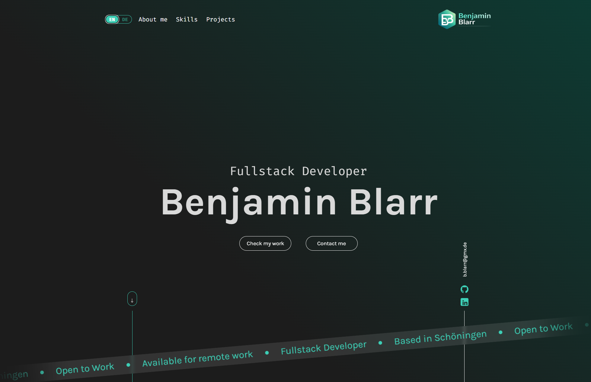

# 👨‍💻 Benjamin Blarr – Portfolio

My personal developer portfolio, built with Angular and TypeScript.

👉 **[Visit the portfolio](https://benjaminblarr.dev/)**



## 📌 About
A responsive single-page portfolio showcasing my projects, skills and background as a Fullstack Developer in training. Available in German and English.

## ✨ Features
- Bilingual (DE/EN) with language switching
- Responsive design across all devices
- Project showcase with live links
- Contact form for direct messaging

## 🛠️ Technologies


---

## 🚀 Getting Started

This project was generated using [Angular CLI](https://github.com/angular/angular-cli) version 20.3.5.

### Development server

```bash
ng serve
```

Navigate to `http://localhost:4200/`.

### Building

```bash
ng build
```

### Running unit tests

```bash
ng test
```

For more information visit the [Angular CLI Overview and Command Reference](https://angular.dev/tools/cli) page.
