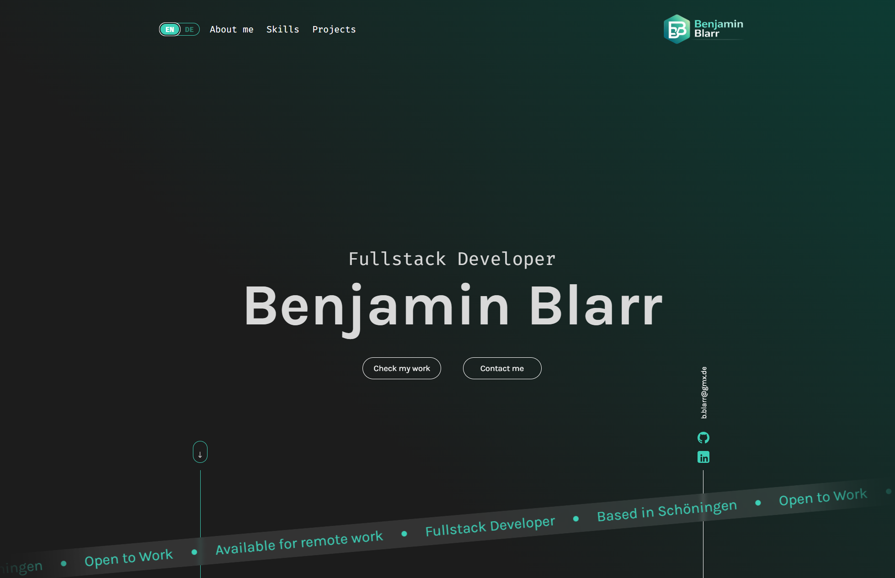

# Benjamin Blarr, Portfolio

My personal developer portfolio, built with Angular and TypeScript.

👉 **[Visit the portfolio](https://benjaminblarr.de/)**

## About

A single-page portfolio in German and English, showing my projects and how to
reach me. The language switch keeps the current position on the page, and the
contact form posts to a Django endpoint on the same server rather than to a
third-party service.

The page also carries an AI assistant. It answers questions about me and my
projects from a knowledge base I wrote myself: a vector search picks the
relevant sections, Claude puts the answer into words, and a separate guard
model checks every question before it reaches the knowledge base or Claude.
Everything except the wording runs on my own server.

## Features

- German and English, switchable without a reload
- Responsive from 4K down to 320 pixels
- Project showcase with links to the running applications
- Contact form with server-side validation and spam protection
- AI assistant answering from my own knowledge base, sources kept on my server

## Built with

**Frontend**

  
  
  
  
  
  
  

Angular 21 with standalone components, SCSS, and no UI framework.

 

**Backend**

  
  
  
  
  
  
  

One Django application on my own server handles both the contact form and the
assistant. The assistant stores its knowledge base as vectors in PostgreSQL
with pgvector and runs its own embedding and guard services next to it. That
code lives in its own repository:
[Coderr-Backend](https://github.com/B-Blarr/Coderr-Backend).
